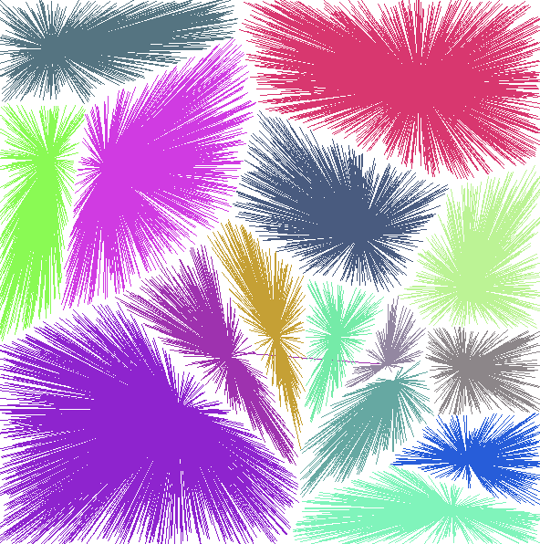
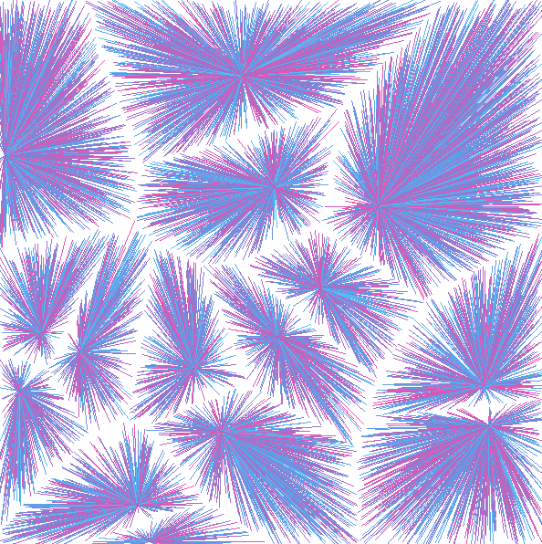

# ⚙️ Visualiseur de Diagramme de Voronoi en Assembleur 

Ce projet implémente un visualiseur de diagramme de Voronoi en langage d'assemblage x86_64 en utilisant X11 pour l'affichage graphique. C'est une façon amusante d'explorer la géométrie computationnelle à bas niveau ! 
*Exemple de visualisation d'un diagramme généré par le programme*

   


## 🔧 Prérequis

Avant de compiler et d'exécuter ce programme, assurez-vous d'avoir les éléments suivants installés :

- **NASM (Netwide Assembler) :** L'assembleur que nous utiliserons.
- **Bibliothèques de développement X11 :** Pour interagir avec le système de fenêtrage X.
- **GCC (pour l'édition de liens) :** Pour combiner notre code assembleur avec les bibliothèques nécessaires.

### Installation des prérequis

**🍎 macOS (avec Homebrew) :**

```bash
brew install nasm
brew install xquartz  # Serveur X11 pour macOS
```

**🐧 Ubuntu/Debian :**

```bash
sudo apt-get install nasm
sudo apt-get install libx11-dev
```

## Compilation ️

Pour compiler le programme, utilisez les commandes suivantes :

```bash
# Assemble le fichier source
nasm -f elf64 -o voronoi-alt.o voronoi-alt.asm

# Édition de liens avec la bibliothèque X11
gcc -o voronoi-alt voronoi-alt.o -lX11
```

## Exécution du programme 

Après la compilation, exécutez le programme avec :

```bash
./voronoi-alt
```

Le programme vous demandera de :

1. Entrer le nombre de centres à générer (les "sites" du diagramme de Voronoi).
2. Entrer le nombre de points cibles à connecter (les points que nous attribuerons au site le plus proche).

Une fenêtre s'ouvrira affichant le diagramme de Voronoi. Appuyez sur n'importe quelle touche pour quitter le programme. ✨

## ✨ Fonctionnalités du programme 

- **Génère des points aléatoires comme centres (affichés en rouge) :** Les graines des cellules de Voronoi. 
- **Crée des points cibles et les connecte à leur centre le plus proche :** Visualisation des régions de Voronoi.
- **Utilise X11 pour l'affichage graphique :** Accès direct au système de fenêtrage X. ️
- **Prend en charge le redimensionnement de la fenêtre :** Le diagramme doit s'adapter aux changements de taille de la fenêtre (si implémenté). 
- **Visualisation interactive :** Vous pouvez voir le diagramme se dessiner. 

## Améliorations potentielles (pour le développement futur) 

- **Coloration des régions de Voronoi :** Chaque région pourrait avoir une couleur distincte. 
- **Calcul de distance plus efficace :** Explorez des algorithmes optimisés.
- **Entrée utilisateur pour les points centraux :** Permettre à l'utilisateur de cliquer pour placer les centres. ️
- **Enregistrement du diagramme dans un fichier :** Exporter la visualisation. 
- **Zoom et panoramique :** Explorer le diagramme en détail. 
- **Ajout de commentaires au code assembleur :** Faciliter la compréhension. 

## Remarques

- Le programme est conçu pour les systèmes 64 bits. 
- Nécessite un serveur X11 en cours d'exécution (XQuartz sur macOS).
- Le nombre maximal d'éléments peut être limité. Envisagez de rendre cela configurable. ⚠️
