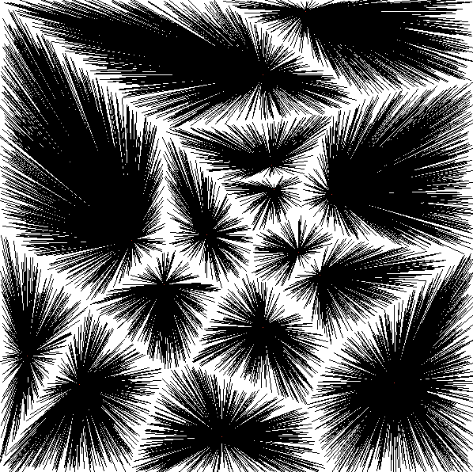

# ⚙️ Voronoi Diagram Viewer in Assembly  

This project implements a **Voronoi diagram viewer** in **x86_64 assembly**, using **X11** for graphical display. It's a fun way to explore computational geometry at a low level!  

### Example Visualizations  

     

---

## 🔧 Prerequisites  

Before compiling and running this program, ensure you have the following installed:  

- **NASM (Netwide Assembler):** The assembler used for compilation.  
- **X11 Development Libraries:** To interact with the X window system.  
- **GCC (for linking):** To combine our assembly code with necessary libraries.  

### Installing Dependencies  

**🍎 macOS (with Homebrew):**  

```bash
brew install nasm
brew install xquartz  # X11 server for macOS
```  

**🐧 Ubuntu/Debian:**  

```bash
sudo apt-get install nasm
sudo apt-get install libx11-dev
```  

---

## ⚙️ Compilation  

To compile the program, run the following commands:  

```bash
# Assemble the source file
nasm -f elf64 -o voronoi-alt.o voronoi-alt.asm  

# Link with the X11 library
gcc -o voronoi-alt voronoi-alt.o -lX11
```  

---

## 🚀 Running the Program  

After compiling, execute the program with:  

```bash
./voronoi-alt
```  

The program will prompt you to:  

1️⃣ Enter the number of generator points (Voronoi "sites").  
2️⃣ Enter the number of target points to connect (points assigned to the nearest site).  

A window will open displaying the **Voronoi diagram**.  
Press any key to **exit**. ✨  

---

## ✨ Features  

✔️ **Generates random points as Voronoi centers** (shown in red).  
✔️ **Creates and connects points to their nearest center**, visualizing Voronoi regions.  
✔️ **Uses X11 for graphical rendering** for efficient display.  
✔️ **Supports window resizing** (if implemented).  
✔️ **Interactive visualization** lets you see the diagram being drawn.   

---

## ⚠️ Notes  

- This program is designed for **64-bit systems**.  
- Requires an **X11 server** to run (**XQuartz on macOS**).  
- The **maximum number of points** may be limited—consider making this configurable.  
